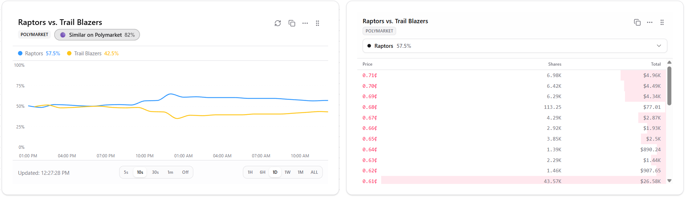
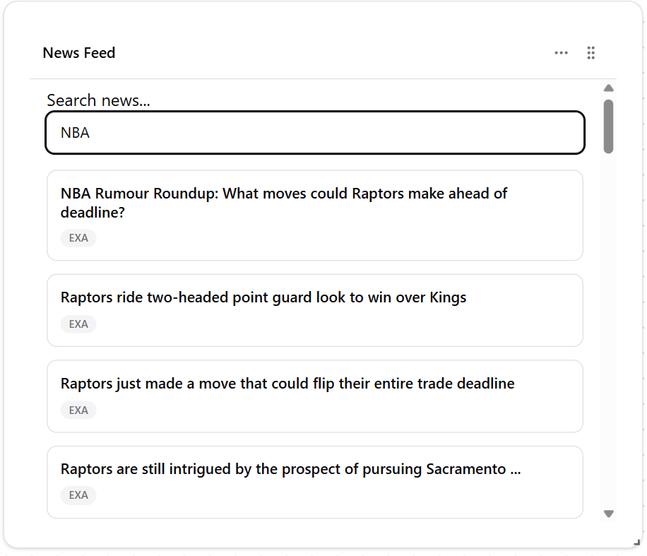
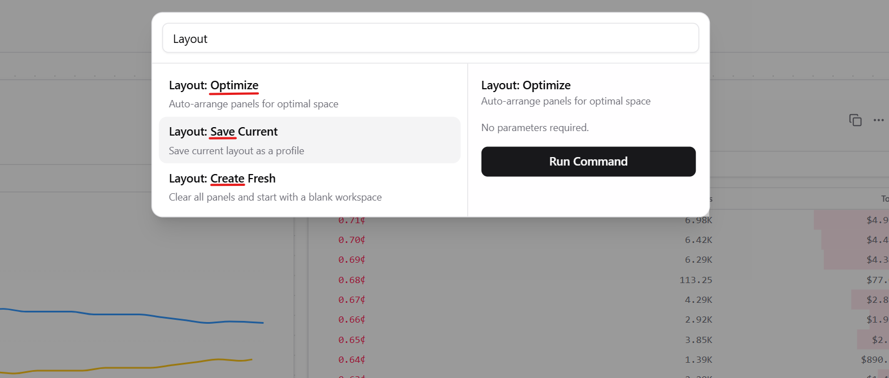
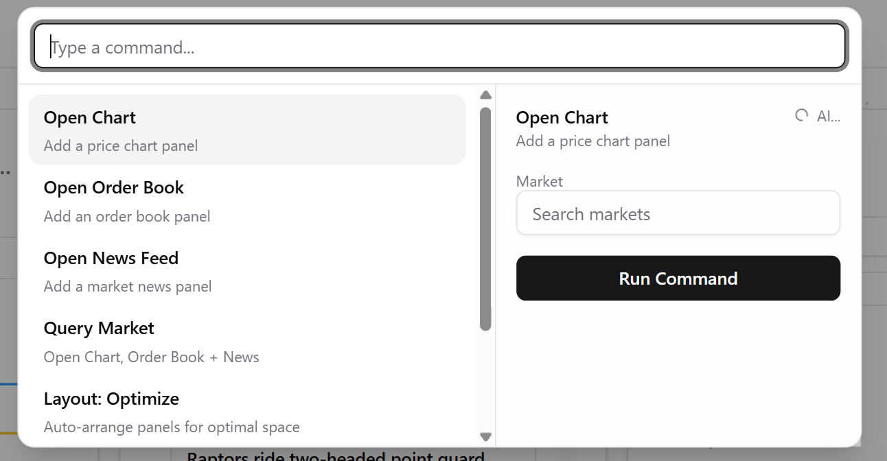
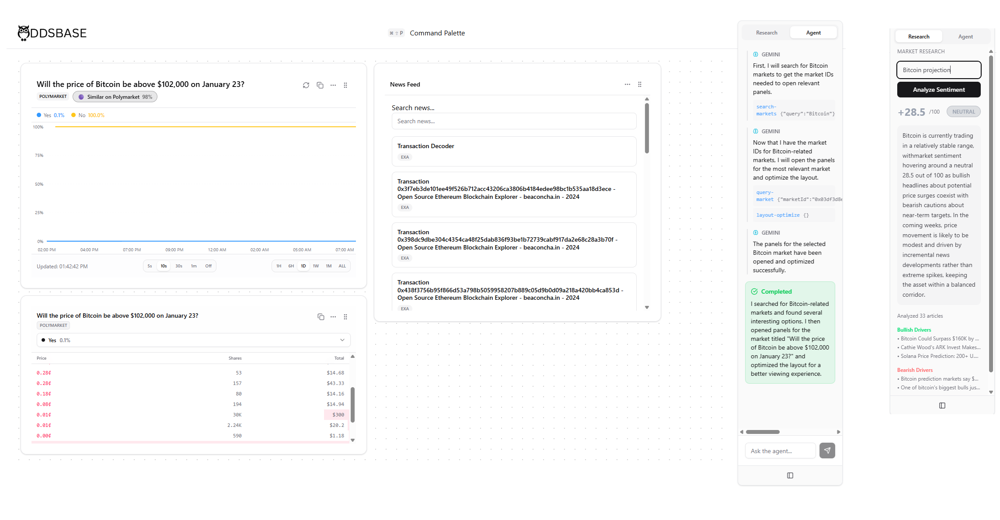

# OddsBase


OddsBase is a web application for making prediction markets and market research accessible to the general public. It was created as a submission to UofTHacks 2026 ([Devpost](https://devpost.com/software/market-market)).

Despite being incredibly powerful predictive tools, **prediction markets aren't very well-understood by the public**. They aggregate the collective wisdom of participants who put real money behind their beliefs, making them remarkably accurate at forecasting future events. Yet accessing this information requires visiting multiple platforms and understanding complex technical interfaces.

The idea for OddsBase came from experiencing the 2024 election cycle firsthand. Reliable polling data wasn't very accessible, election forecasters were very biased as usual, and the prediction markets were spot-on. Since this is still quite a niche field, we asked ourselves: *What if there was a Bloomberg Terminal for prediction markets—one that was accessible to everyone?*

## Features

The central function of OddsBase is to aggregate Kalshi and Polymarket data into a single interface, allowing users to easily compare and analyze market data. These two are by far the biggest prediction market platforms, which, when integrated together, covers roughly 90% of the prediction market volume globally. Each are reliable and trusted by experts for their data. Kalshi is trusted because it's a US government-verified platform, while Polymarket is a decentralized (crypto-based) platform. 

The interface of the application is designed to make these markets easy to use and access. The rest of the features assist the user in learning about the markets, customizing their experience, saving dashboards for future use, and making decisions.

### Real-time Data



Through the use of WebSockets, OddsBase is able to provide real-time data to the user. This allows the user to see the current state of the markets, as well as any changes that occur in real-time.

### News



Live keyword-based news feed that updates in real time, with a focus on market-relevant news. Users can specify topics they are interested in, and the most relevant news will be selected and displayed.

### Dashboard


Dashboards are individual "market layout pages" that users can fully customize to their liking. For example, one can research the odds of a particular NBA team winning a specific game.

Dashboard layouts can be created, saved, and optimized through the command palette.



### Command Palette



The command palette is a modal that allows users to access every feature quickly and easily. It also makes the interface accessible to the AI agents so they cna perform actions at the command of the users.

## Agents



### Research Agent

The research agent scours the top 100 most relevant articles on a given topic and gives a market summary as well as a bullishness rating.

### Dashboard Creator

Prompt the agent with a topic, and it will create a dashboard for you.

### Predictive Agent

Adapts to your recent market research over time, filtering search fill recommendations and results based on recent activity 

## Data Sources & Project Architecture

This project gets its data from a few different APIs to make sure our information is as accurate and broad as possible.

### Prediction Markets

We aggregate data from the two industry leaders. **Polymarket** provides access to decentralized, high-volume markets via their Gamma and CLOB APIs. **Kalshi** provides institutional-grade, US-regulated data through their official REST API. By combining these, OddsBase gives you a view of the entire prediction market landscape in one place.

### News & Research

Our news feed isn't just a simple RSS reader. We pull data from **EXA.ai**, **GDELT**, **Newsdata.io**, and **CryptoPanic**. This allows our research agents to analyze a topic from multiple angles before giving you a summary or a sentiment score.

### Architecture

OddsBase follows a **full-stack TypeScript/Python architecture**:

```
┌─────────────────────────────────────────────────────────────┐
│                        FRONTEND                             │
│  React 19 + TypeScript + Zustand + TailwindCSS              │
│  ├── Resizable drag-and-drop panel grid                     │
│  ├── Real-time WebSocket chart updates                      │
│  ├── Server-Sent Events for streaming news                  │
│  └── Command palette with AI agent integration              │
├─────────────────────────────────────────────────────────────┤
│                        BACKEND                              │
│  FastAPI + Python 3.11+                                     │
│  ├── Polymarket Connector (Gamma + CLOB APIs)               │
│  ├── Kalshi Connector (REST API)                            │
│  ├── Multi-source News Fetcher (EXA, GDELT, Newsdata)       │
│  ├── Intelligent News Ranking (relevance + recency)         │
│  └── WebSocket subscription manager                         │
└─────────────────────────────────────────────────────────────┘
```

### Technical Stack

The system is built on a high-performance, modern stack. The **FastAPI** backend handles real-time data normalization and WebSocket broadcasting, while the **React 19** frontend (built with **Bun**) provides a snappy, resizable dashboard. We use the **Backboard SDK** to give our agents memory, allowing them to learn from your activity over time.

## Running the Project

### Prerequisites

- Make sure you have a correct version of Python installed
- uv: `pip install uv`
- bun: `https://bun.sh/`

### APIs

To access the data and agents that this project relies on, you will need to create an `env` file and fill it with API keys for the following:

```env
# EXA.ai: Agent-based news finder.
EXA=1234ab12-abc1-1234-a12a-123abcd1a123

# newsdata.io: General News, basically backup
NDIO=pub_12345a123ab123a12abc1232

# CryptoPanic
CPANIC=123123ababac12d1c11c12131312a1111

# OpenRouter
OPENROUTER_API_KEY=sk-or-a1-aaaaaaaaaaaaaaaaaaaaaaaaaaaaaaaa

# Backboard.io
BACKBOARD=abc_abc_abc-12908bd8y27
```

### Backend

Download dependencies:

```bash
uv sync
```

Run development server:

(Make sure you navigate to the `backend/` directory first)

```bash
uv run python -m uvicorn  app.main:app --reload
```

The backend will be pingable at `http://localhost:8000`.

### Frontend

(Make sure you navigate to the `frontend/` directory first)

To install dependencies:

```bash
bun install
```

To start a development server:

```bash
bun dev
```

The frontend will be up at `http://localhost:3000`.
